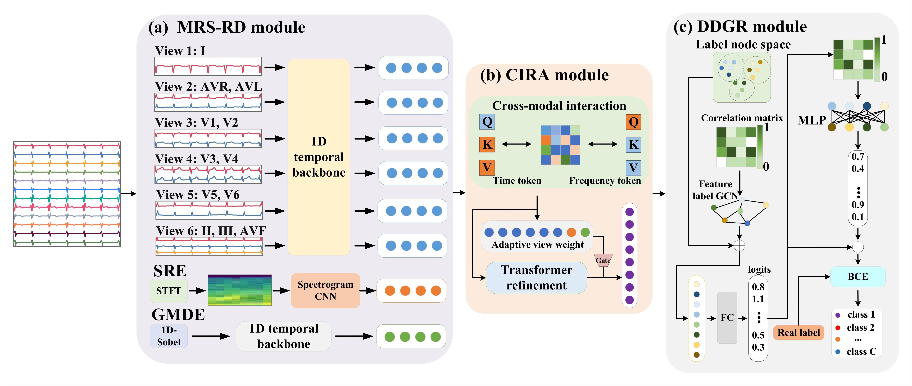

# MORSE-Net

Official implementation of **MORSE-Net: A Structured Multi-Representation Co-Reasoning Network for Multi-Label 12-Lead ECG Diagnosis**.

MORSE-Net is designed for multi-label 12-lead ECG diagnosis. It jointly models morphology, rhythm-frequency patterns, spatial lead-region information, and diagnostic label dependencies for robust ECG classification.

---

## Overview

<p align="center">
  
</p>

<p align="center">
  <b>Figure 1.</b> Overall architecture of MORSE-Net.
</p>

---

## Requirements

The code is implemented in Python with PyTorch. The main dependencies are:

```text
Python >= 3.8
PyTorch >= 1.10.0
NumPy >= 1.21.0
SciPy
Pandas
Scikit-learn
WFDB
TQDM
Matplotlib
PyYAML
```

Install the required packages with:

```bash
pip install -r requirements.txt
```

---

## Usage

### Configuration

Training and evaluation settings are defined in:

```text
config.py
```

Please modify the dataset path, number of classes, training parameters, and output directory according to your local environment.

### Training

After preparing the dataset and updating the configuration file, run:

```bash
python main_train.py
```

For the MiniRocket-based training strategy, run:

```bash
python minirocket_train.py
```

---

## Data Preparation

In our experiments, ECG recordings are resampled to **100 Hz** and adjusted to **1000 samples per lead**. Each ECG sample is represented as a tensor with the following shape:

```text
12 × 1000
```

For recordings longer than 10 seconds, the first 1000 samples are used. For recordings shorter than 10 seconds, zero-padding is applied.

---

## Datasets

MORSE-Net was evaluated on the following public 12-lead ECG datasets.

| Dataset | Description | Link |
| --- | --- | --- |
| PTB-XL | A large-scale public 12-lead ECG dataset | https://physionet.org/content/ptb-xl/ |
| CPSC 2018 | 12-lead ECG dataset from the China Physiological Signal Challenge | http://2018.icbeb.org/Challenge.html |
| HFHC | Multi-label ECG dataset from the Tianchi ECG competition | https://tianchi.aliyun.com/competition/entrance/231754/information |
| Chapman-Shaoxing | 12-lead ECG dataset with a large diagnostic label space | https://physionet.org/content/ecg-arrhythmia/1.0.0/ |

---

## Model Architecture

MORSE-Net consists of three main components.

### 1. Morphology--Rhythm--Spatial Representation Decomposition

This module extracts complementary ECG representations from 12-lead ECG signals, including temporal morphology, rhythm-frequency patterns, and morphology-gradient information.

### 2. Cross-Representation Interaction and Residual Aggregation

This module models interactions among different ECG representations and adaptively aggregates multi-view ECG features for more discriminative representation learning.

### 3. Dual-Stage Diagnostic Label Graph Reasoning

This module captures diagnostic label dependencies and improves multi-label ECG prediction through structured label-level reasoning.

---

## Input Format

The expected input format is:

```text
batch_size × 12 × 1000
```

where:

- `12` denotes the number of ECG leads.
- `1000` denotes the number of time samples after preprocessing.
- `batch_size` denotes the number of ECG recordings in a mini-batch.

---

## Project Structure

A typical project structure is shown below:

```text
MORSE-Net/
├── img/
│   └── Figure_1.jpg
├── config.py
├── main_train.py
├── minirocket_train.py
├── requirements.txt
└── README.md
```

---

## Notes

Please make sure that the dataset paths, label files, and training settings are correctly specified in `config.py` before running the training scripts.

The figure shown in the overview section should be placed at:

```text
./img/Figure_1.jpg
```

If the file name or extension is different, please update the image path in `README.md`.

---

## Citation

If you find this repository useful, please consider citing our work.

```bibtex
@article{morsenet,
  title={MORSE-Net: A Structured Multi-Representation Co-Reasoning Network for Multi-Label 12-Lead ECG Diagnosis},
  author={},
  journal={},
  year={}
}
```

---

## License

This project is released for academic research purposes.
